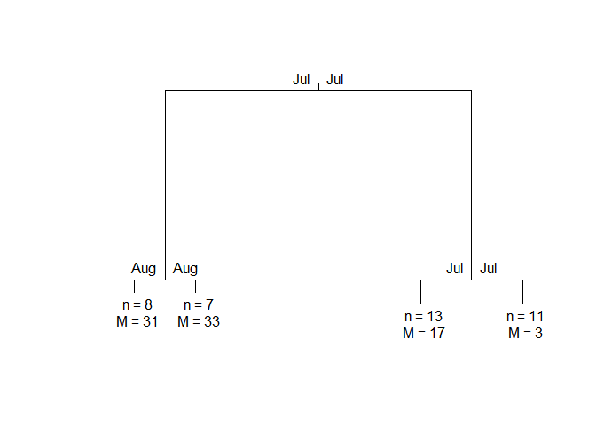
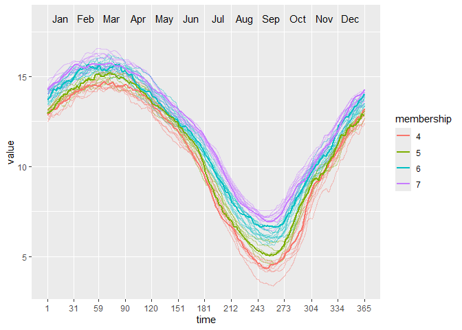

<!-- README.md is generated from README.Rmd. Please edit that file -->

# puls

<!-- badges: start -->

[](https://travis-ci.com/vinhtantran/puls)
[](https://github.com/vinhtantran/puls/actions)
<!-- badges: end -->

Partitioning using local subregions (PULS) is a clustering technique
designed to explore subregions of functional data for information to
split the curves into clusters.

## Installation

You can install the released version of puls from
[CRAN](https://CRAN.R-project.org) with:

``` r
install.packages("puls")
```

And the development version from [GitHub](https://github.com/) with:

``` r
# install.packages("devtools")
devtools::install_github("vinhtantran/puls")
```

## Example

This is a basic example which shows you how to solve a common problem:

``` r
library(puls)
library(fda)
#> Loading required package: Matrix
#> 
#> Attaching package: 'fda'
#> The following object is masked from 'package:graphics':
#> 
#>     matplot
# Build a simple fd object from already smoothed smoothed_arctic
data(smoothed_arctic)
NBASIS <- 300
NORDER <- 4
y <- t(as.matrix(smoothed_arctic[, -1]))
splinebasis <- create.bspline.basis(rangeval = c(1, 365),
                                    nbasis = NBASIS,
                                    norder = NORDER)
fdParobj <- fdPar(fdobj = splinebasis,
                  Lfdobj = 2,
                  # No need for any more smoothing
                  lambda = .000001)
yfd <- smooth.basis(argvals = 1:365, y = y, fdParobj = fdParobj)

Jan <- c(1, 31); Feb <- c(31, 59); Mar <- c(59, 90)
Apr <- c(90, 120); May <- c(120, 151); Jun <- c(151, 181)
Jul <- c(181, 212); Aug <- c(212, 243); Sep <- c(243, 273)
Oct <- c(273, 304); Nov <- c(304, 334); Dec <- c(334, 365)

intervals <-
  rbind(Jan, Feb, Mar, Apr, May, Jun, Jul, Aug, Sep, Oct, Nov, Dec)

PULS4_pam <- PULS(toclust.fd = yfd$fd, intervals = intervals,
                  nclusters = 4, method = "pam")
#> Warning: executing %dopar% sequentially: no parallel backend registered
PULS4_pam
#> n = 39 
#> 
#> Node) Split, N, Cluster Inertia, Proportion Inertia Explained,  
#>       * denotes terminal node
#> 
#> 1) root 39 8453.2190 0.7072663   
#>   2) Jul 15  885.3640 0.8431711   
#>     4) Aug 8  311.7792   *
#>     5) Aug 7  178.8687   *
#>   3) Jul 24 1589.1780 0.7964770   
#>     6) Jul 13  463.8466   *
#>     7) Jul 11  371.2143   *
#> 
#> Note: One or more of the splits chosen had an alternative split that reduced inertia by the same amount. See "alt" column of "frame" object for details.
```

You can make a tree plot:

``` r
plot(PULS4_pam)
```



Or, a wave plot:

``` r
ggwave(toclust.fd = yfd$fd, intervals = intervals, puls = PULS4_pam)
```


